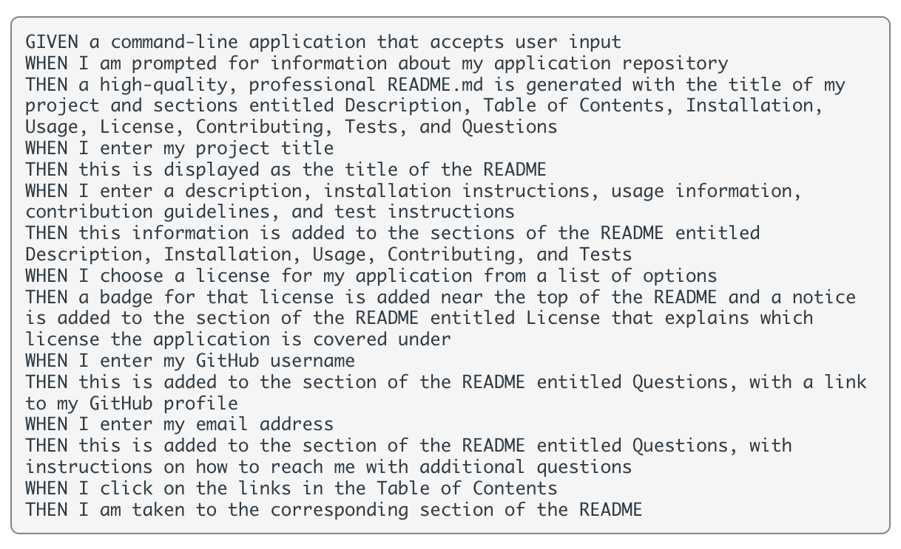

  # README Generator
  As a user, I want to create a professional README Generator application. When the user answer the prompted questions, the answer input will automatically generate a README file for the project
  

  ## Table of Contents
  1. [Acceptance Criteria](#acceptance-criteria)
  2. [Installation](#installation)
  2. [Usage](#usage)
  3. [License](#license)
  4. [Contribution](#contribution)
  5. [Author](#author)
  6. [Contact](#contact)

  ## Acceptance Criteria
  

  ## Installation:
  Before running this apllication, do a npm install first

  ## Usage:
  Go to the repository, do a git clone, open it in VS code. enter "node index.js" in terminal to generate prompted questions

  ## License:
  License used for this project - MIT

  ## Contribution:
  Here are the steps needed if you want to contribute to this application:
  - Fork the repo
  - Create a feature branch (git checkout -b branchName)
  - Commit your new feature (git commit -m 'what you contributed')
  - Push your branch (git push)

  ## Author
  Jie Zou

  ## Contact:
  jz3134@columbia.edu
